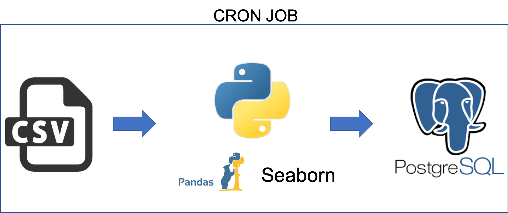
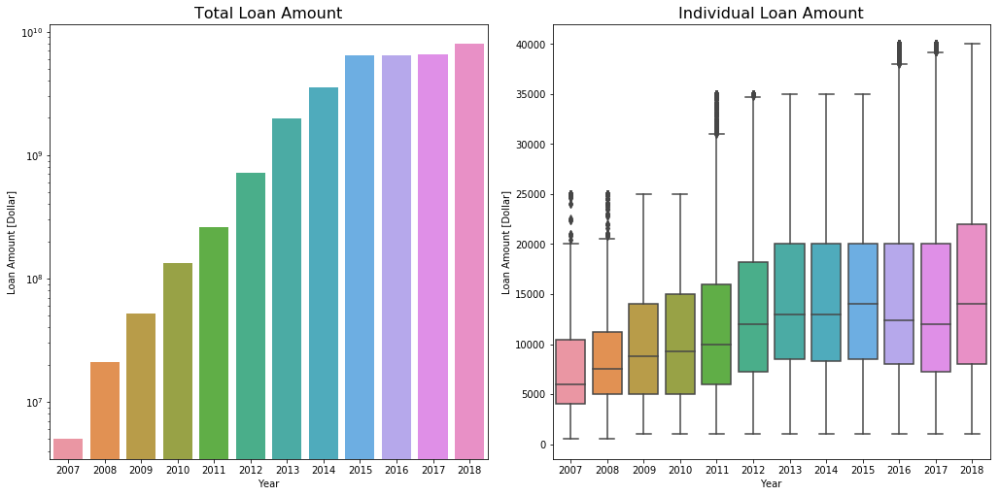
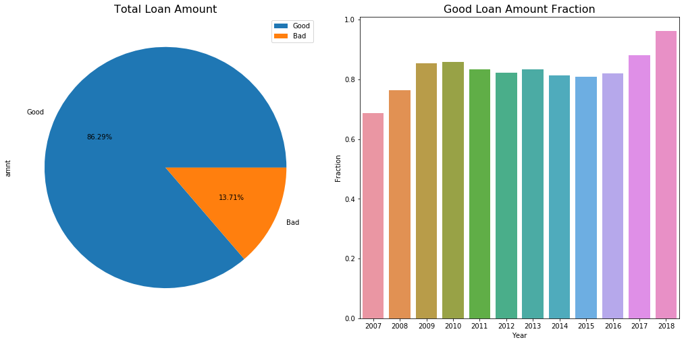

# LendingClub Loan Data Pipeline-building and Exploratory Data Analysis

## Table of Contents
1. [Introduction](README.md#introduction)
1. [Pipeline Implementation](README.md#pipeline-implementation)
1. [Run Instructions](README.md#run-instructions)
1. [Exploratory Data Analysis](README.md#exploratory-data-analysis)
1. [Future Works](README.md#future-works)

## Introduction

LendingClub is a U.S. peer-to-peer lending company. It enables borrowers to create unsecured personal loans between $1,000 and $40,000. The standard loan period is three years. Investors can search and browse the loan listings on LendingClub website and select loans that they want to invest in based on the information supplied.

In this project, I am provided with a dataset containing the loan origination listings of LendingClub from 2007 to 2018. I will build an ETL pipeline for data, with the goal for providing interactive and flexible querying for data scientists and data analysts to explore and train machine learning models using the data. This involves:

- Creating a data model / schema in a database or storage engine
- Developing code that will persist the dataset into this storage system in a fully automated way
- Including any data validation routines that may be necessary

Furthermore, I am going to perform exploratory data analysis (EDA) using this data. This serves as a good way to acquire a sense of the data and inform pipeline engineering as well as future analyses.

The open dataset is downloaded from [Kaggle](https://www.kaggle.com/wendykan/lending-club-loan-data). The 1.19GB CSV file contained is used as the data source, and the Excel file LCDataDictionary.xlsx provides explanation for the columns. The CSV file contains 145 columns and more than 2 million rows.

For the data pipeline, Python and PostgreSQL will be used. I use a jupyter notebook to lay out the steps in the EDA.

## Pipeline Implementation

The ETL pipeline is built using the Python programming language, and I use the Pandas package to wrangle the data. I perform data validation and transformation, and create tables in the PostgreSQL relational database system to persist the results. Due to the fact that the data represents loan information, where ACID (atomicity, consistency, isolation, and durability) should be critical, the choice of PostgreSQL, an RDBMS, should be justifiable. In addition, complex queries can be made with ease with a SQL database, which is desirable for data scientists and analysts who are the end users of this pipeline. To reduce redundancy and anomalies, I normalize the original table into five sub-tables linked by loan ID and borrower ID.

### Data Validation and Transformation

I validated and transformed the data in three ways:

1. Exploring missing data. Many fields are null in the original dataset. Most importantly, the loan `id` and borrower `member_id` are completely missing. This prevents me from splitting the table due to a lack of unique keys to identify each loan or borrower. To address this, I assign to each loan and borrower an ID number identical to the Pandas index. The assumption here is that there are no duplicate borrowers.

2. Date to datetime64 transformation. The dates in the original dataset are of `String` type. To enable future use of time-oriented queries on this data, I transformed the dates to NumPy datetime64 dtype.

3. Checking loan amount. The requested dollar amount of each loan should always be greater or equal to the actual funded amount. I specifically perform this check. No anomalies were found.

### Schemas

To reduce anomalies and redundancy, I choose to split the original table, which consists of 145 columns, into five smaller but more normalized tables. Note that even though dropping certain columns where there are many nulls or where the columns are highly correlated will reduce the problem size, I choose not to do so. I leave the task of determining which columns are useful to the data analysts and data scientists, and here I will try to preserve all information.

The original table is split into these five tables:
- loan: contains information about the loan
- borrower: contains information about the loan borrower
- joint: contains information about the joint loan applicant
- hardship: contains information about the hardship plan
- debt settlement: contains information about debt settlements
Each table in principle represents an independent set of properties. For example, a borrower with a loan does not need to have a joint applicant.

Overall the pipeline can be visualized as


### Project Structure
```
.
├── README.md
├── data
│   └── loan.csv
├── detect_new_files.sh
├── eda.ipynb
├── images
│   ├── good_loan.png
│   └── total_loan_amount.png
├── run.sh
├── schedule_cron.sh
├── setup_db_properties.sh
└── src
    ├── main.py
    └── module.py
```

## Run Instructions

### Dependencies
1. Python 2.7 or above
2. Python standard library
3. NumPy, Pandas, SqlAlchemy, Seaborn, Matplotlib

### Preparing PostgreSQL database

Install PostgreSQL on your desired machine. Edit the file `setup_db_properties.sh` to reflect your configuration. Create a database in PostgreSQL with name identical to ${POSTGRESQL_DATABASE} in `setup_db_properties.sh`. For example, do

```#postgres=> CREATE DATABASE lending_club_database;```

### Run the code

Before running the code, be sure to do
```
EXPORT LENDING_CLUB_DIR=/path/to/this/repo
```
You can add this to your `.bashrc` file and source it.

There are two ways to run the code - manual run or automated update. Both assume a database setup such as the one described above.

#### Manual

Simply do

```
sh run.sh /path/to/your/data.csv
```

The `run.sh` script will source the database settings, and create/append data to database.

#### Automated

One can imagine that the data is updated periodically, where new data files show up in the /data directory. Using the `schedule_cron.sh` script, one can schedule periodic checks for new files, and process them.

To do so, simple edit the following line in `schedule_cron.sh`
```echo "0 0 * * * /bin/bash /path/to/your/detect_new_files.sh"```
Choose the check frequency and edit the path to your `detect_new_files.sh` script. This example checks and processed new files daily.

Then, simply do
```
sh schedule_cron.sh
```
Your automated checks have been scheduled!


## Exploratory Data Analysis

In this section, I use a Jupyter notebook to analyze the data. You can find the notebook that creates the figures at `eda.ipynb`

On a high level, we may want to know the amount of loans issued per year to understand the magnitude of the business. I show the total amount of loans, and the box-plot distribution of the loans per year in this figure:



One can observe that the amount of loans grew rapidly from millions of dollars in 2007 to close to 10 billion dollars in 2018. However, since 2014 the growth has slowed down significantly.

We may also want to understand the amount of loans that are in good conditions, and compare that value to the total amount of loans. Here, I categorize the following loan statuses as 'bad':

- Charged Off
- Late (31-120 days)
- In Grace Period
- Late (16-30 days)
- Does not meet the credit policy. Status:Charged Off
- Default

The rest of the statuses are considered 'good'. The following figure shows the percentage of the good/bad loans, and how the fraction of good loans evolve over time:



One can observe that overall the good loans occupy around 86% of the total loan amount. However, since 2016 this percentage started to increase, reaching ~96% in 2018. This could represents lower risks for lenders, and also a recovering economy.

## Future Works

 1. The data size we are dealing with in this project is a little over 1GB. As the data size scale up, we can consider using distributed computing such as AWS to build the pipeline. We could store the raw data on Amazon S3, and batch-process with Apache Spark. The processed data can be stored in Amazon Redshift, or a cloud data warehouse such as Snowflake. These workflows can be scheduled using Airflow or Luigi.

 2. Even though I broke down the original table to five sub-tables, these tables are not yet completely normalized. Further steps can be taken to reduce redundancy. However, given such complex relations, a fully 3NF database could compromise scalability.
